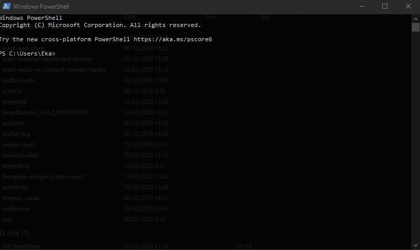

# Memulai Gatsby

Sebelum memulainya, sangat perlu untuk pengenalan dasar beberapa inti dari Teknologi Web seperti [HTML](https://www.w3schools.com/html/), [CSS](https://www.w3schools.com/css/), dan [Javascript](https://www.w3schools.com/js/default.asp).

## Command Line (CLI)

Command-line adalah alat yang memiliki ciri `text-based` dan dijalankan pada komputer dengan fungsi sebagai jembatan komunikasi dengan komputer, biasa disebut dengan `terminal`, CLI banyak ditemukan pada lingkunagn Linux, Windows, dan Mac.

## Install NodeJS pada Sistem Operasi

[NodeJS](https://nodejs.org/en/) adalah suatu tool yang dapat menjalankan kode-kode Javascript tanpa Browser, Gatsby dijalankan dengan menggunakan NodeJS

### 🖥 Instalasi pada Windows

Untuk instalasi pada Windows silahkan download pada [official NodeJS](https://nodejs.org/en/). Terdapat 2 versi yaitu LTS (Long Term Support) dan Latest Features atau versi terakhir, cobalah menggunakan versi terakhir.

### 🖥 Instalasi pada Mac

Untuk instalasi NodeJS menggunakan Mac, direkomendasikan menurut team [Gatsby](https://www.gatsbyjs.org/tutorial/part-zero/) adalah menggunakan [Homebrew](https://brew.sh/), ketik perintah seperti di bawah:

```
brew install node
```

### 🖥 Instalasi pada Linux

#### Ubuntu, Debian:

1. Pastikan distribusi Linux update dan Upgrade

```
sudo apt update
sudo apt -y upgrade
```

2. Install curl untuk proses transfer data dan download penambahan library lainnya (dependencies)

```
sudo apt-get install curl
```

3. Download `nvm`

```
curl -o- https://raw.githubusercontent.com/nvm-sh/nvm/v0.35.1/install.sh | bash
```

4. Pastikan `nvm` bekerja dengan baik

```
nvm --version
```

5. Set default untuk versi NodeJS, contoh `12` adalah set secara default untuk versi 12 (LTS)

```
nvm install 12
nvm use 12
```

6. Pastikan sekali lagi NodeJS dan NPM berjalan dengan baik

```
npm --version
node --version
```



## Menggunakan Gatsby CLI

Gatsby CLI digunakan membuat proyek Gatsby melalui terminal, install Gatsby CLI menggunakan terminal:

```
npm install -g gatsby-cli
```

Cobalah ketik seperti di bawah untuk mengetahui perintah apa saja pada Gatsby CLI:

```
gatsby --help
```

## Membuat proyek Gatsby pertama

1. Saatnya membuat Gatsby Site pertama, untuk memudahkan konfigrasi gunakan [Gatsby Starters](https://www.gatsbyjs.org/starters/) untuk memulai proyek ini.

```
gatsby new hello-world https://github.com/gatsbyjs/gatsby-starter-hello-world
```

💡 Arti perintah di atas:

> `new` adalah perintah untuk membuat proyek Gatsby, keyword `hello-world` adalah nama proyek yang dibuat beserta direktorinya

2. Masuk ke direktori `hello-world`

```
cd hello-world
```

3. Jalankan dengan perintah `develop`:

```
gatsby develop
```

4. Buka browser dan ketik `http://localhost:8000/`, pastikan di browser tampil `Hello world!`

## ➡️ Apa selanjutnya
Tutorial ini berasal dari dokumentasi [Official Gatsby](https://www.gatsbyjs.org/tutorial/part-zero/), untuk selanjutnya bisa  
