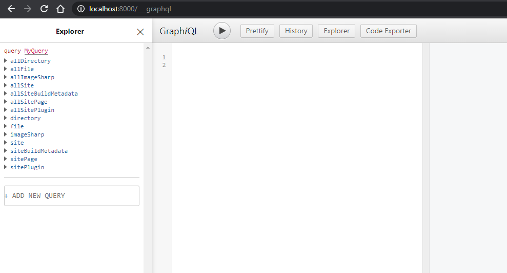

# Data Query Menggunakan GraphQL dan Gatsby Source Filesystem

Mencoba lebih dalam lagi tentang GraphQL dan menggunakan `gatsby-source-filesystem` sebagai loader data,

- install plugin filesystem:
```
npm install --save gatsby-source-filesystem
```

- Tambahkan sebagimana di bawah pada `gatsby-config.js`:
```js
module.exports = {
  siteMetadata: {
    title: `Pandas Eating Lots`,
  },
  plugins: [
    {
      resolve: `gatsby-source-filesystem`,
      options: {
        name: `src`,
        path: `${__dirname}/src/`,
      },
    },
  ],
}
```

Buka browser dan jalankan `http://localhost:8000/___graphql`:
[](./assets/graphql.mp4)

